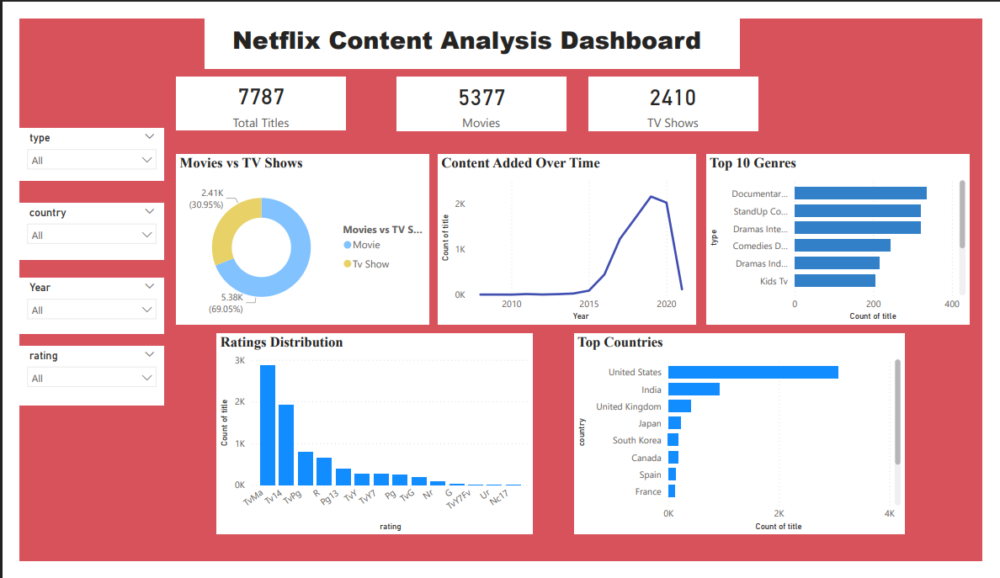

# 🎬 Netflix Content Analysis Dashboard

## 📌 Overview

This project presents an interactive Power BI dashboard built using a cleaned Netflix dataset. The dashboard analyzes Netflix's content library to uncover trends in content type, genres, ratings, countries, and content additions over time.

---

## 🎯 Objectives

- Clean and prepare the dataset for analysis.
- Perform Exploratory Data Analysis (EDA).
- Build an interactive Power BI dashboard.
- Generate insights through data visualization.

---

## 🛠️ Tools & Technologies

- Python
- Pandas
- NumPy
- SQL
- Microsoft Excel
- Microsoft Power BI

---

## 📂 Dataset

The project uses a cleaned Netflix dataset prepared for analysis and visualization.

---

## 🔄 Project Workflow

- Imported the dataset.
- Cleaned and preprocessed the data using Python.
- Performed Exploratory Data Analysis (EDA).
- Built an interactive Power BI dashboard.
- Generated insights using charts, KPI cards, and slicers.

---

## 📊 Dashboard Features

- KPI Cards (Total Titles, Movies, TV Shows)
- Movies vs TV Shows Distribution
- Content Added Over Time
- Top 10 Genres
- Ratings Distribution
- Top Countries
- Interactive Filters (Type, Country, Year, Rating)

---

## 📈 Key Insights

- Movies represent the majority of Netflix's content library.
- The United States has the highest number of titles.
- Documentary and Stand-Up Comedy are among the most common genres.
- Content additions increased significantly after 2016.
- Interactive filters allow users to explore content by country, year, type, and rating.

---

## 💡 Skills Demonstrated

- Data Cleaning
- Data Preprocessing
- Exploratory Data Analysis (EDA)
- Data Visualization
- Dashboard Development
- Business Intelligence
- Python
- Pandas
- NumPy
- Microsoft Power BI
- Microsoft Excel

---

## 🖼️ Dashboard Preview



---

## 📁 Repository Contents

```
netflix-content-analysis-dashboard/
│── Netflix_Content_Analysis.pbix
│── cleaned_dataset netflix.xlsx
│── dashboard.png
│── README.md
```

---

## 👩‍💻 Author

**Niharika Singh**

Aspiring Data Analyst | Python | SQL | Power BI | Microsoft Excel
